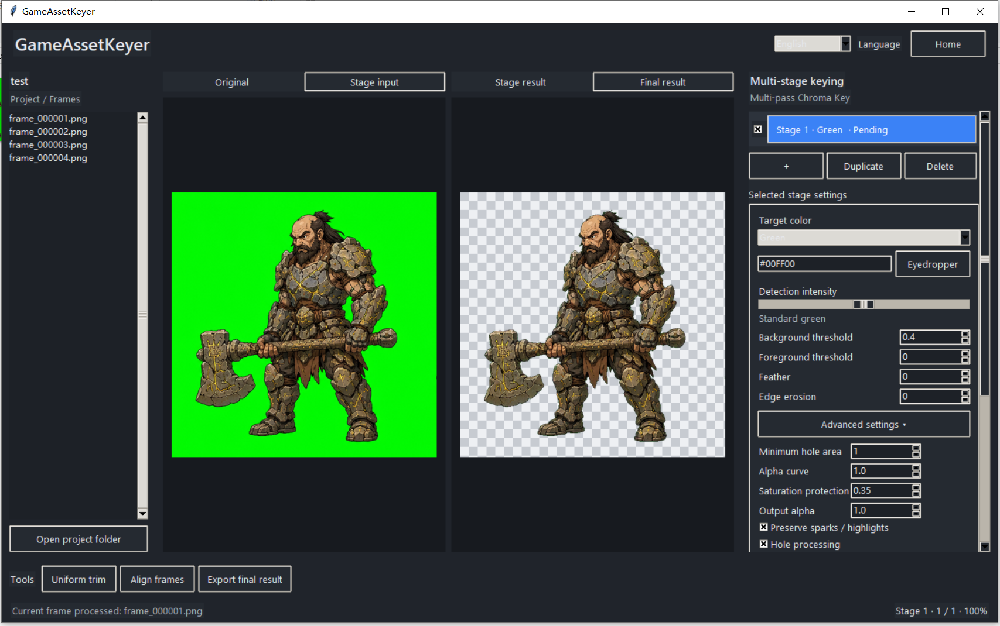
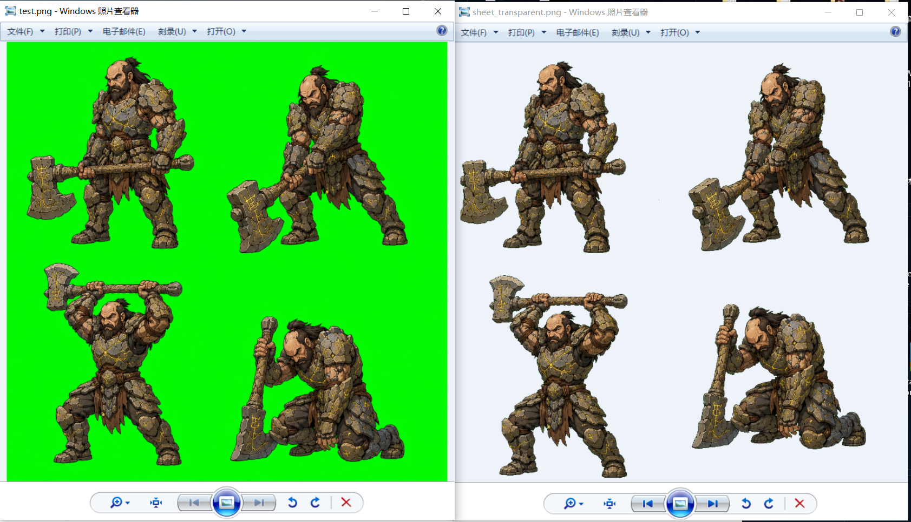
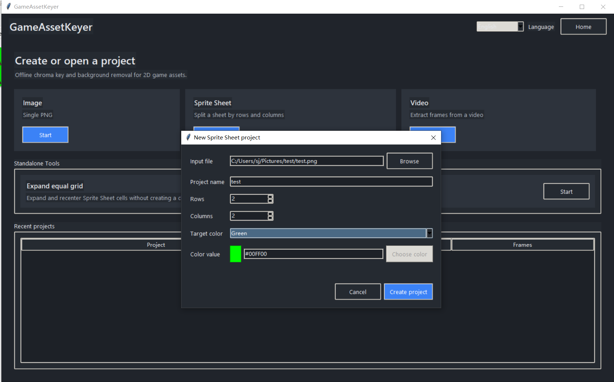
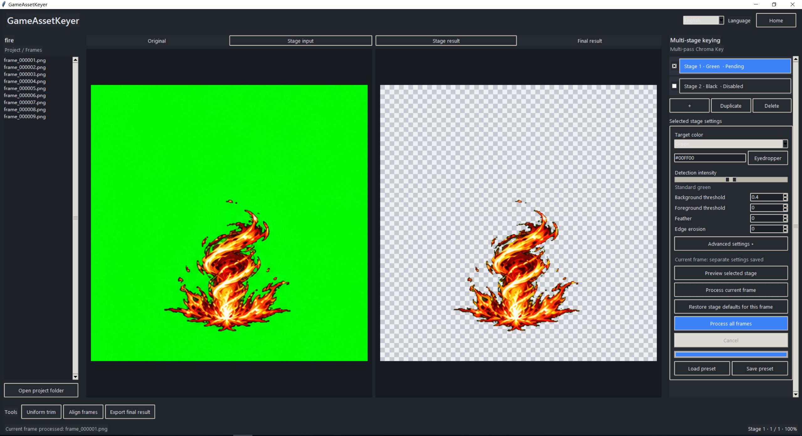
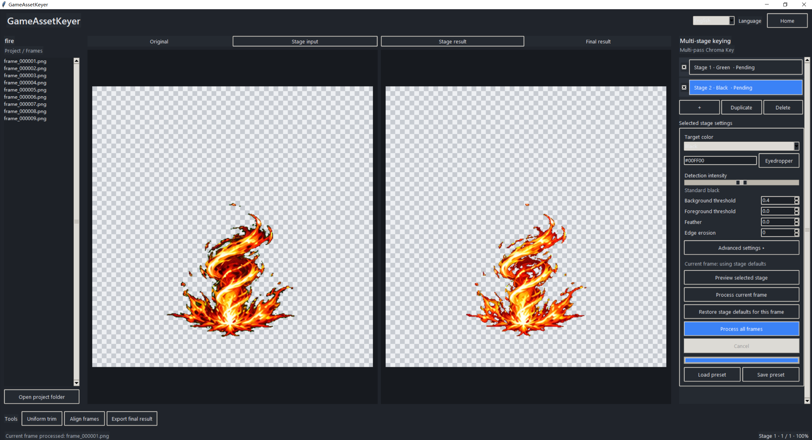
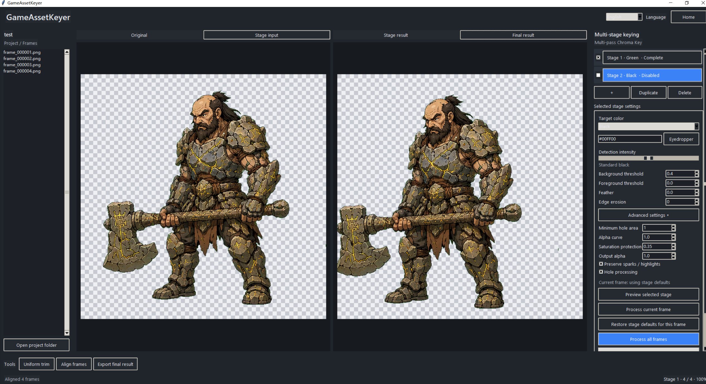

# GameAssetKeyer

Offline chroma key and background removal for 2D game assets.

**Images · Sprite Sheets · Video Frames**  
**Custom Colors · Multi-pass Chroma Key**  
**Batch Processing · Trim · Align · Rebuild**  
**Offline · No AI · No Upload**

GameAssetKeyer is an offline chroma-key and background-removal workflow for 2D game assets.

It can process single images, sprite sheets, and video frames, with custom target colors, unlimited multi-pass keying, batch processing, trimming, center alignment, and sprite-sheet rebuilding.

It is designed for practical 2D production workflows, including AI-generated sprites, rendered assets, traditional chroma-key artwork, effects, characters, and animation frames. GameAssetKeyer itself contains no AI runtime, model download, API integration, or upload feature.



## Why GameAssetKeyer?

Background removal is often only one step in preparing game-ready animation assets. GameAssetKeyer keeps frame splitting, repeated color-key passes, exceptional-frame tuning, trimming, alignment, preview, and sheet rebuilding in one deterministic local workflow.

- Files stay on your computer.
- Every stage uses explicit parameters.
- Individual frames can override stage defaults.
- Later stages cannot restore Alpha removed by earlier stages.
- Stale post-processing output is rejected when its Pipeline source changes.
- The Final Result preview and export resolve to the same pixel source.

## Features

- Single PNG processing
- Sprite Sheet splitting, processing, and rebuilding
- Video frame extraction and ordered RGBA PNG frame-sequence export
- Black, white, green, and magenta presets
- Custom RGB chroma key and eyedropper
- Unlimited multi-pass stages with per-stage parameters
- Per-frame parameter overrides
- Background batch processing with progress and cancellation
- Non-destructive disk-backed Pipeline and cache invalidation
- Alpha monotonic protection across stages
- Unified trimming and center or bottom-center alignment
- Sprite Sheet rebuild and transparent export
- Standalone equal-grid expansion utility
- Real-time animation preview for processed frame sequences
- Adjustable playback FPS without changing the selected frame
- PNG Sequence → Sprite Sheet Composer
- Natural frame ordering for sequence inputs
- Center / bottom-center frame placement
- Transparent cell padding
- English and Simplified Chinese application UI
- Fully offline processing with no AI runtime and no file uploads

## Before and After

GameAssetKeyer can rebuild the processed frames into a complete transparent Sprite Sheet suitable for a game-asset workflow.



## Sprite Sheet Workflow

Create a Sprite Sheet project in one window by selecting the source image, project name, row and column counts, and initial target color.



```text
Sprite Sheet
  ↓
Split frames
  ↓
Multi-pass background removal
  ↓
Trim and alignment
  ↓
Rebuild transparent sheet
```

Single PNG projects use the same keying workflow without row and column fields. Video projects extract frames first, use the same Pipeline and post-processing tools, and export the current Final Result as an ordered `frame_000001.png` PNG sequence rather than rebuilding a Sprite Sheet.

## Multi-pass Chroma Key

GameAssetKeyer does not require every background color to be removed in one pass. Each Stage has independent target color, thresholds, feathering, edge settings, and advanced parameters.

For example:

```text
Pass 1: Green #00FF00
  ↓
Pass 2: Black or dark background
  ↓
Final transparent effect
```





Additional Stage 3, Stage 4, and later passes can be added as needed. Stages can also be enabled, disabled, duplicated, deleted, and reordered.

## Trim, Alignment, and Final Result

Unified Trim computes one shared crop across the frame set. Frame Alignment then shifts visible content toward a shared center or bottom-center anchor while preserving a consistent canvas.



The `Final Result` preview uses the same final-result resolution logic as `Export Final Result`. Apart from UI scaling and the checkerboard display, the preview represents the current pixels that export will use.

```text
Current valid Pipeline output
  ↓
Valid Trim, if available
  ↓
Valid Alignment, if available
  ↓
Final Result Preview and Export
```

Post-processing results carry source signatures. If the Pipeline changes, old trim and alignment directories are no longer treated as current results.

## Download

Windows users do not need Python or `pip`.

1. Download `GameAssetKeyer-v1.1.0-Windows-x64.zip` from the [Releases](../../releases) page.
2. Extract the entire archive to a normal writable folder.
3. Run `GameAssetKeyer.exe`.

Do not move `GameAssetKeyer.exe` out of the extracted folder. Keep the `_internal` directory beside the executable.

The Windows executable is currently unsigned, so Windows SmartScreen may display a warning. Releases include a SHA-256 checksum for verification. Do not disable antivirus or SmartScreen globally.

## Run from Source

Runtime dependencies support Python 3.11 or later. Python 3.13 is used by source CI; the official Windows build uses the separately pinned environment below. A Python installation with Tkinter/Tcl/Tk is required.

```bat
python -m venv .venv
.venv\Scripts\activate
python -m pip install -r requirements.txt
python GameAssetKeyer.py
```

Run checks:

```bat
python GameAssetKeyer.py --check
python -m unittest discover -s tests -v
```

## Building the Windows Release

Official v1.0 Windows releases use:

- Python 3.14.3 x64
- Tcl/Tk 8.6.15
- PyInstaller 6.21.0
- pyinstaller-hooks-contrib 2026.6
- NumPy 2.4.4
- opencv-python-headless 4.13.0.92
- Pillow 12.2.0

Run `build_release.bat` from a Windows environment with the pinned Python available. The script creates an isolated build environment, runs tests, builds the package, copies the complete Tcl/Tk runtime, verifies required runtime files, and produces the ZIP plus its checksum.

Official releases use PyInstaller **onedir**, not onefile.

## Contributing and Security

See [CONTRIBUTING.md](CONTRIBUTING.md) before submitting changes. Security issues should follow [SECURITY.md](SECURITY.md).

## License

GameAssetKeyer is licensed under the [Mozilla Public License 2.0 (MPL-2.0)](LICENSE).
Changes to MPL-covered source files remain subject to MPL 2.0 when distributed.
